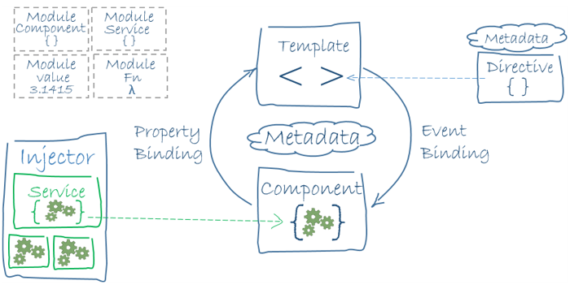
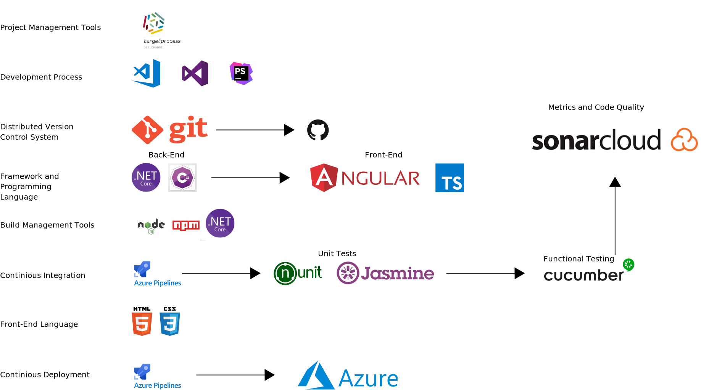
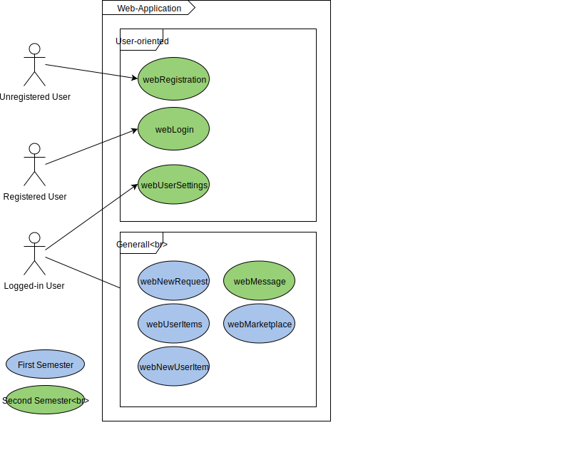
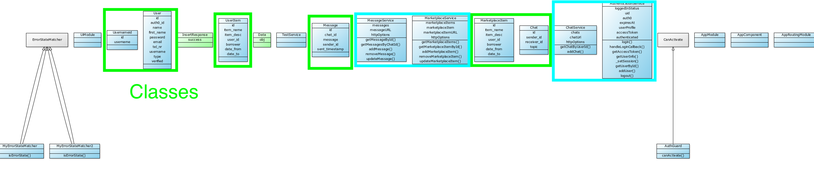
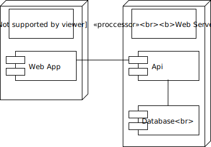
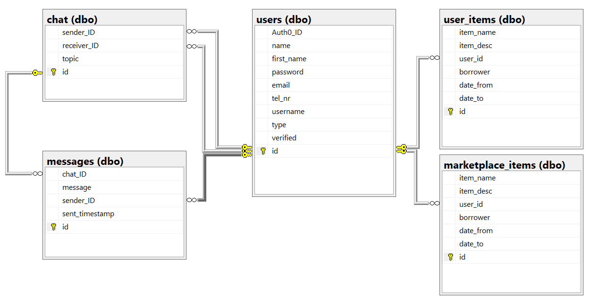

# Software Architecture Document

## 1. Introduction

### 1.1	Purpose
This document provides a comprehensive architectural overview of the system, using a number of different architectural views to depict different aspects of the system. It is intended to capture and convey the significant architectural decisions which have been made on the system.

### 1.2	Scope
This document is closely related to the Software Requirement Specifications and the defined Use Cases. You can find both in the GitHub repository of this Project. 
 
### 1.3	Definitions, Acronyms, and Abbreviations
|Term |Definition |
|-|-|
|MVC| Model View Controller|
|N.a| Not applicable|

### 1.4	References
|Term|Definition|	
|:-:|:-:|
|Github Repository| https://github.com/KeepThings|
|Blog| https://keepthingsnlb.wordpress.com/|

### 1.5	Overview
This Document contains information about our software architecture. In more details, you can find information about Architectural Representation, Architectural Goals and Constraints, Use-Case View,
Logical View, Process View, Deployment View, Implementation View, Data View, Size and Performance and Quality.

## 2. Architectural Representation
This section describes what software architecture is for the current system. Our Project consists of a Angular Application. Angular is based on the Model-View-ViewModel architecture.
This diagram describes the main aspects of the Angular architecture.

## 3. Tech Stack

In the following picture you an see the tech stack with includes every tool used in the project.

## 4. Architectural Goals and Constraints
The architecture of Angular is slightly different to MVC. In Angular your View has the ability to change the Model and vise versa. This is a very important difference to the MVC.

## 5. Use-Case View

### 5.1 Use-Case Realization
N.a

## 6. Logical View

### 6.1 Overview

### 6.2	Architecturally Significant Design Packages
N.a

## 7. Process View 
N.a

## 8. Deployment View 

## 9. Implementation View 

### 9.1 Overview
N.a

### 9.2 Layers
N.a

## 10. Data View
We are using a MySQL database. Here you can see our database scheme.

## 11. Size and Performance
N.a

## 12. Quality
N.a
