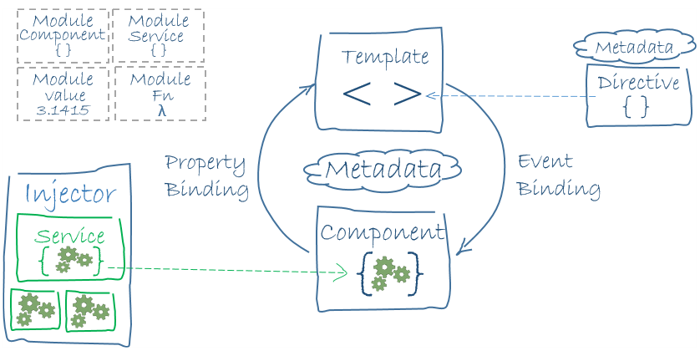

# Software Architecture Document

## 1. Introduction

### 1.1	Purpose
This document provides a comprehensive architectural overview of the system, using a number of different architectural views to depict different aspects of the system. It is intended to capture and convey the significant architectural decisions which have been made on the system.

### 1.2	Scope
This document is closely related to the Software Requirement Specifications and the defined Use Cases. You can find both in the GitHub repository of this Project. 
 
### 1.3	Definitions, Acronyms, and Abbreviations
* MVC = Model View Controller
* N.a = Not applicable

### 1.4	References
* Github Repository: https://github.com/KeepThings
* Blog: https://keepthingsnlb.wordpress.com/

### 1.5	Overview
This Document contains information about our software architecture. In more details, you can find information about Architectural Representation, Architectural Goals and Constraints, Use-Case View,
Logical View, Process View, Deployment View, Implementation View, Data View, Size and Performance and Quality.

## 2. Architectural Representation
This section describes what software architecture is for the current system. Our Project consists of two Applications. We have an Angular Application and an Android Application. These have different architectures. Angular is based on the Model-View-ViewModel architecture.
This diagram describes the main aspects of the Angular architecture.

The architecture of Android is MVC. This diagram describes the main aspects of the MVC.

## 3. Architectural Goals and Constraints
The architecture of Angular is slightly different to MVC. In Angular your View has the ability to change the Model and vise versa. This is a very important difference to the MVC.
The MVC architecture has a very simple functionality. You have a View which gets User actions and passes them to the Controller. The Controller sends data to the Model or updates the View with the data received from the Model. The Model is the logic of the application.

## 4. Use-Case View

### 4.1 Use-Case Realization
N.a

## 5. Logical View

### 5.1 Overview

### 5.2	Architecturally Significant Design Packages
N.a

## 6. Process View 
N.a

## 7. Deployment View 
N.a

## 8. Implementation View 

### 8.1 Overview
N.a

### 8.2 Layers
N.a

## 9. Data View
We are using a MySQL database. Here you can see our database scheme.

## 10. Size and Performance
N.a

## 11. Quality
N.a

