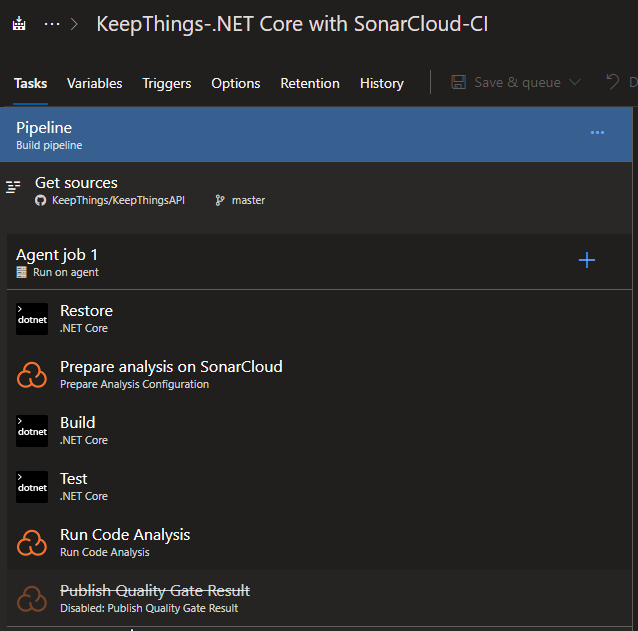
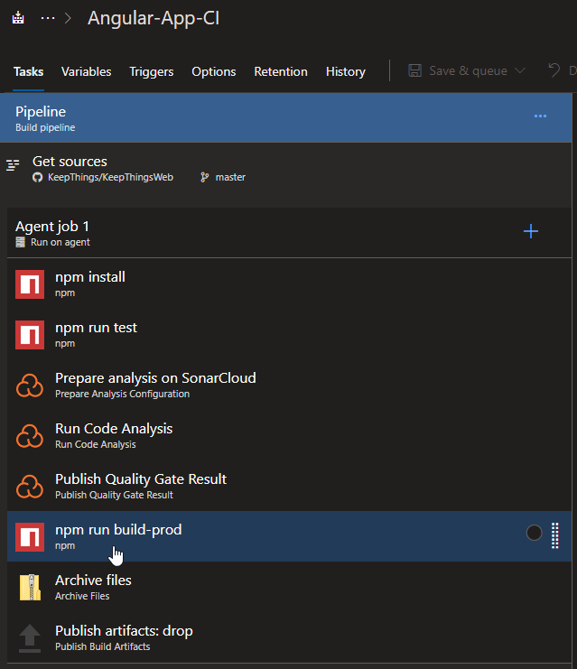
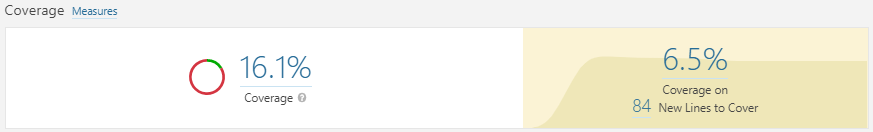
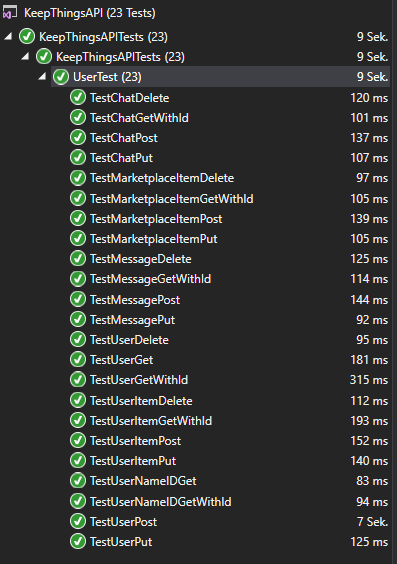
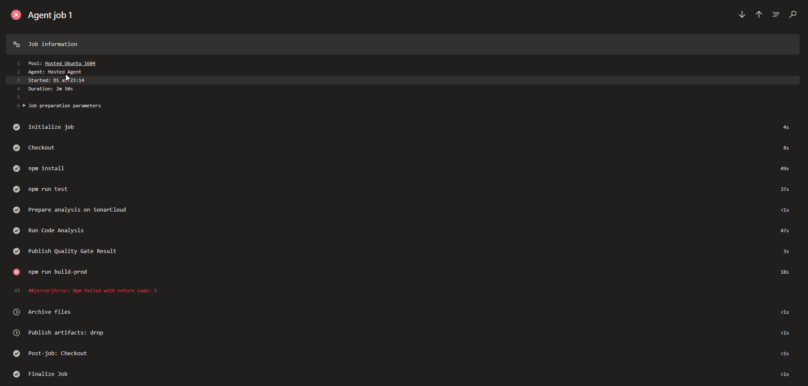

# Test Plan
## 1.	Introduction
### 1.1	Purpose
The purpose of the Iteration Test Plan is to gather all of the information necessary to plan and control the test effort for a given iteration. It describes the approach to testing the software, and is the top-level plan generated and used by managers to direct the test effort.
This Test Plan for KeepThings supports the following objectives:
-	Identifies the items that should be targeted by the tests.
-	Identifies the motivation for and ideas behind the test areas to be covered.
-	Outlines the testing approach that will be used.
-	Identifies the required resources and provides an estimate of the test efforts.
### 1.2	Scope
This test plan cover tests for the whole application. This includes frontend, backend and the communication with the server.
-	Unit Testing
-	Integration Testing
-	User Interface Testing
### 1.3	Intended Audience
The intended audience of this test plan are the developers themselves. This document is on a technical level, so it is for more advanced readers who need the necessary background knowledge.
### 1.4	Document Terminology and Acronyms
|Abbr|Abbreviation|
|-|-|
|UI|User Interface|
|n/a|not applicable|
|tbd|to be done|
### 1.5	 References
| Title                                                                   | Date       | Publishing organization   |
| ------------------------------------------------------------------------|:----------:| ------------------------- |
| [Blog](https://keepthingsnlb.wordpress.com)                          | Oct. 2018  | KeepThings                 |
| [GitHub Repository](https://github.com/KeepThings/)        | Oct. 2018  | KeepThings                 |
| [UC1 webLogin](./UseCases/webLogin/webLoginUCS.md)              | Oct. 2018  | KeepThings                 |
| [UC2 webMarketplace](./UseCases/webMarketplace/webMarketplaceUCS.md)          | Apr. 2019  | KeepThings                 |
| [UC3 webMessages](./UseCases/webMessages/webMessagesUCS.md)          | Apr. 2019  | KeepThings                 |
| [UC4 webNewRequest](./UseCases/webNewRequest/webNewRequestUCS.md)          | Oct. 2018  | KeepThings                 |
| [UC5 webNewUserItem](./UseCases/webNewUserItem/webNewUserItemUCS.md)          | Oct. 2018  | KeepThings                 |
| [UC6 webRegistration](./UseCases/webRegistration/webRegistrationUCS.md)          | Oct. 2018  | KeepThings                 |
| [UC7 webUserItems](./UseCases/webUserItems/webUserItemsUCS.md)          | Oct. 2018  | KeepThings                 |
| [UC8 webUserSettings](./UseCases/webUserSettings/webUserSettingsUCS.md)          | Apr. 2019  | KeepThings                 |
| [Test Plan](./TestPlan.md)                                              | Apr. 2019  | KeepThings                 |
| [SRS](./SoftwareRequirementSpecifications.md)                          | Oct. 2018  | KeepThings                 |
| [SAD](./SoftwareArchitectureDocument/SoftwareArchitectureDocument.md)                               | Oct. 2018  | KeepThings                 |
## 2.	Evaluation Mission and Test Motivation
### 2.1	Background
Testing our application helps us ensure that changes to the application's source-code will not result in errors or any other malfunctions in our application. By integrating these tests into our deployment process, we make sure that only working versions of our project are getting deployed to end-users.
### 2.2	Evaluation Mission
Testing is one of the most important points of developing. It has to be guaranteed at all times that all the code is working especially before you publish the 
### 2.3	Test Motivators
The tests are done to ensure quality and mitigate risks and fulfill functional requirements. Their purpose is to provide stability for our application.
## 3.	Target Test Items
The listing below identifies those test items software, hardware, and supporting product elements that have been identified as targets for testing. This list represents what items will be tested.
-	Angular Backend
## 4.	Outline of Planned Tests
### 4.1	Outline of Test Inclusions
Front End: 
-	User Interface testing via survey
-	Feature files of android fragments

Backend: 
-	Unit testing
### 4.2	Outline of Other Candidates for Potential Inclusion
n/a
### 4.3	Outline of Test Exclusions
Because of time and resource constraints we will not do:
-	Stress test
-	Load/performance tests
-	Usability tests
-	any further tests

## 5.	Test Approach
### 5.1	Testing Techniques and Types
#### 5.1.1 Unit Testing

Unit testing ensures, that the tested sourcecode works as expected. Therefore small parts of the sourcecode are tested independently.

|                       | Description                                                         |
|-----------------------|---------------------------------------------------------------------|
|Technique Objective    | Ensure that the implemented code works as expected                  |
|Technique              | Implement test methods using JUnit Framework (Frontend & Backend)   |
|Oracles                | Test execution logs results to the command line, logs in CI/CD Tool (Travis) |
|Required Tools         | JUnit 4 & 5 and NUnit Dependencies  in Frontend and Backend                    |
|Success Criteria       | All tests pass.                                                     |
|Special Considerations | -                                                                   |

#### 5.1.2 Functional Automated Testing

By functional automated testing the application is tested from the perspective of the user. The goal  is to ensure that the components behaves as expected.

|                       | Description                                                          |
|-----------------------|----------------------------------------------------------------------|
|Technique Objective    | Test application automated from the perspective of the user through UI Test |
|Technique              | Writing Gherkin `.feature` files with clearly defined steps and the expected result. The test implementation of the steps use the Android Espresso library to serve the emulator.|
|Oracles                | Expect that the steps of the test are executed successfully and the UI behaves as planned.|
|Required Tools         | Dependencies of Cucumber and Espresso (official Android UI test library) and an Implementation of a test runner based on JUnit 4 to execute UI tests with Cucumber and Espresso.|
|Success Criteria       | All UI tests pass.|
|Special Considerations | - |

#### 5.1.3 User Interface Testing (survey)

In order to test the UI we created a survey where the users can give feedback on the convenience and the appealing of the UI. They are also given the option to give further feedback if they think something is missing. The goal of this is to use the feedback make the application better.

|                       | Description                                                          |
|-----------------------|----------------------------------------------------------------------|
|Technique Objective    | Gather feedback of the users to improve application |
|Technique              | Creating a form where the users can give feedback. Form: https://docs.google.com/forms/d/e/1FAIpQLSemQznFyR700t9joSKrizXcCjPdRBzJdsBiGA9bdvS6wL50sg/viewform?usp=sf_link |
|Oracles                | Expect that the user gives usefull feedback and the developer consider implementing the feedback.|
|Required Tools         | No tools required, the user just has to visit the website http://keepthingsweb.azurewebsites.net/ and create an account to test the application.|
|Success Criteria       | Gettings useful feedback|
|Special Considerations | - |

## 6.	Entry and Exit Criteria
### 6.1	Test Plan
#### 6.1.1	Test Plan Entry Criteria
After a successfull build the testprocess will be executed.
#### 6.1.2	Test Plan Exit Criteria
All tests pass without throwing an error.
## 7.	Deliverables
### 7.1	Test Evaluation Summaries

We are using Azure Pipelines to automate the tests every time something gets pushed to the master branch. The test result is then published to sonarCloud for our Angular App. For the API there is no test coverage integration in the free Visual Studio version which is why we have no evalutation of it. But we have 100% coverage in the API which we will show in the the test coverage reporting.
In the picture below you can see our pipelines for the web-application and the api.

### 7.2	Reporting on Test Coverage

 

This badge is for the angular app only.

For the api we can't visualize the test coverage in sonarqube because we would need Visual Studio Enterprice to generate a Log-file, containing the test coverage. Instead you can see in the following picture all the working Unittest for the api. They cover 100% of it's funktionality.

### 7.3	Perceived Quality Reports
We use sonarCloud.io for our quality reports. Here you can see the badges for our code quality, duplicated lines and the bugs.

### 7.4	Incident Logs and Change Requests
As soon as one task in the pipeline fails the other tasks are skipped and the pipeline is stopped. Nothing will be pushed to the live server.

## 8.	Testing Workflow
Every developer can run tests inside the IDE manually. Whenever new commits are pushed or a new pull request is created all tests will be executed automatically.
## 9.	Environmental Needs
### 9.1	Base System Hardware

The following table sets forth the system resources for the test effort presented in this Test Plan.
| Ressource | Quantity | Name |
| :--------: |: --------: |: -------- :|
| CI / CD Server     | 1     | AzureDevops Pipeline     |
| Local testing machine     | 1     | Any computer more or less modern computer     |

### 9.2	Base Software Elements in the Test Environment

The following base software elements are required in the test environment for this Test Plan.
| Software | Type and other info |
| -------- | -------- | -------- |
| Jasmine / Karma     |Runs unit tests for Angular     |
| NUnit    |Runs unit tests for .Net Core     |
| Cucumber    |Runs functional user interface tests     |

### 9.3	Productivity and Support Tools
The following tools will be employed to support the test process for this Test Plan.

| Tool Category or Type | 	Tool Brand Name |
| -------- | -------- | -------- |
| Repository Hoster     | [GitHub](https://github.com)     |
| Test Coverage Monitor     | [SonarCloud](https://sonarcloud.io)     |
| CI/CD Service     | [Azure DevOps](https://azure.microsoft.com/de-de/services/devops/)     |
| Metrics Tool     | [SonarCloud](https://sonarcloud.io)     |

## 10.	Responsibilities, Staffing, and Training Needs
### 10.1	People and Roles

| Role          | Person Assigned |  Specific Responsibilities or Comments |
|---------------|--------------|----------------------------------------|
| Test Manager | Nils | Provides management oversight. |
| Test Designer | Nils, Lukas, Benedikt | Defines the technical approach to the implementation of the test effort. |
| Test System Administrator | Nils | Ensures test environment and assets are managed and maintained. |

### 10.2	Staffing and Training Needs
n/a

## 11.	Iteration Milestones
Our goal is to get 42% code coverage.		

## 12.	Risks, Dependencies, Assumptions, and Constraints
[List any risks that may affect the successful execution of this Test Plan, and identify mitigation and contingency strategies for each risk. Also indicate a relative ranking for both the likelihood of occurrence and the impact if the risk is realized.]

| Risk | Mitigation Strategy | Contingency (Risk is realized) |
|------|---------------------|--------------------------------|
| Code has lots of side effects | Refactor code (Clean Code principles) | publish new refactored tests |
| Test Runner is not able to execute tests | Use standard libraries which include working Test Runner | fix test execution configuration |
| Test data proves to be inadequate | Rewiev test data | Revise the test data |
| Tools can not read test coverage | search for another tool | use the new tool |

## 13.	Management Process and Procedures
n/a

