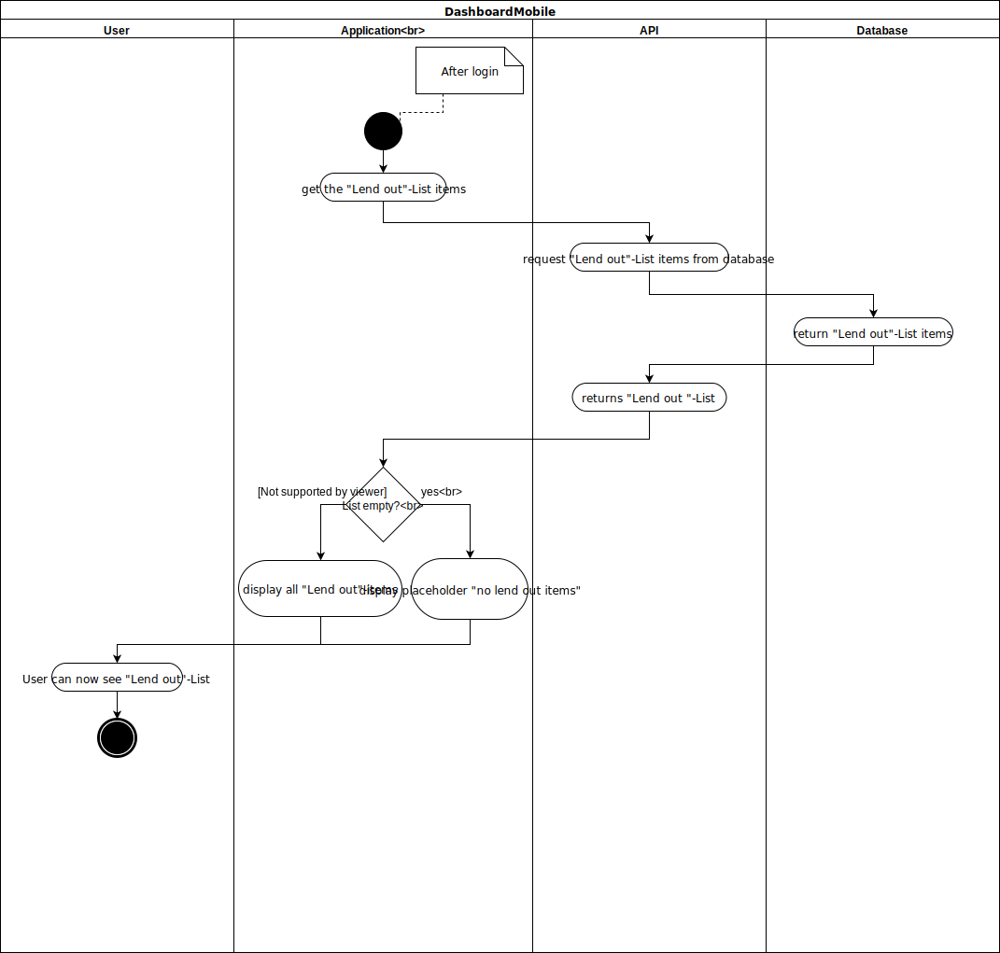

# Use-Case Specification: DashboardMobile

## 1. DashboardMobile

### 1.1 Brief Description
Shows all lent out items of the user in a list. One item contains the name of the lent item, person who borrowed the item, the date it was borrowed and the date it should be returned. 

## 2. Flow of Events

### 2.1 Basic Flow

#### Activity Diagram

#### Feature
[/Features/dashboardMobile.feature](https://github.com/KeepThings/KeepThingsWeb/blob/master/recources/Features/dashboardMobile.feature)
#### Mockup

## 3. Special Requirements

n/a

## 4. Preconditions

### 4.1 Log in
 The user must be logged in first.

 
## 5. Postconditions

### 5.1 synchronization of data
synchronization of the data between server and client.

## 6. Extension Points
n/a 

