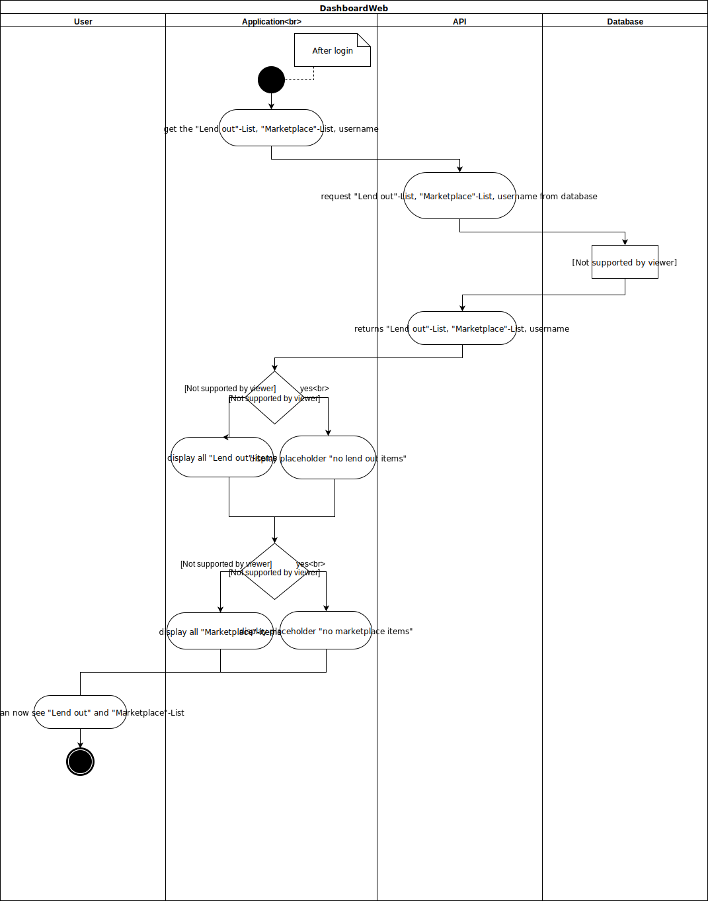

# Use-Case Specification: DashboardWeb

## 1.                  DashboardWeb

### 1.1               Brief Description
Shows all lent out items of the user and the marketplace items in a list. One item of the lent-out list contains the name of the lent item, person who borrowed the item, the date it was borrowed and the date it should be returned. One item of the marketplace list contains the name of the item someone wants to borrow and the date it is needed. On the right side of the dashboard the user can create new entries and requests.

Mockup:

## 2.                  Flow of Events

### 2.1               Basic Flow

	
	
## 3.                  Special Requirements
n/a

## 4.                  Preconditions

### 4.1               Log in
 The user must be logged in first.
 
 
## 5.                  Postconditions

### 5.1               synchronization of data
synchronization of the data between server and client.

## 6.                  Extension Points
n/a 

