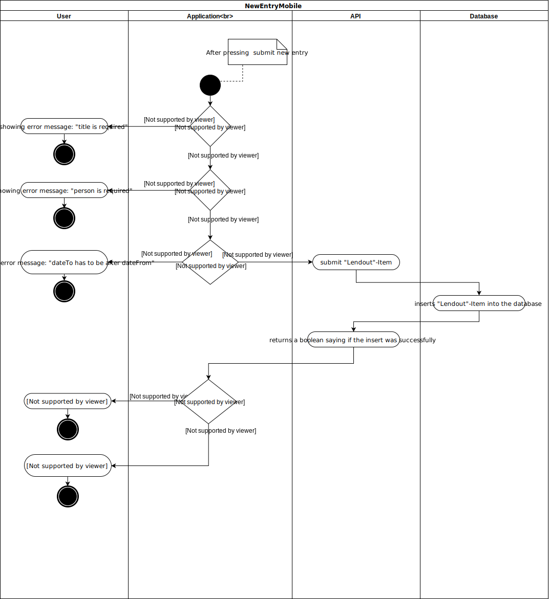
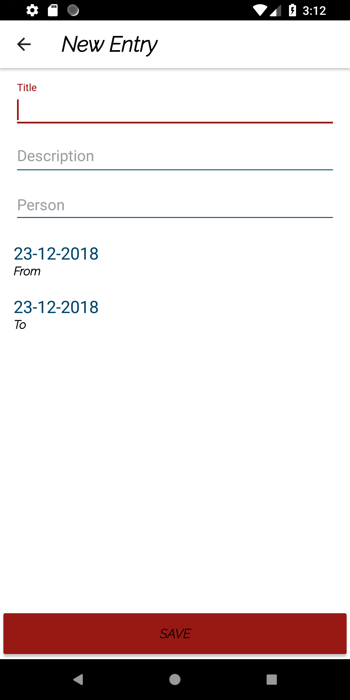

# Use-Case Specification: newEntryMobile

## 1.                  newEntryMobile

### 1.1               Brief Description
User can add a new Entry via the entry form. Application checks if all required fields have an input and if the dateTo is later than dateFrom.

## 2.                  Flow of Events

### 2.1               Basic Flow

#### Activity Diagram

#### Feature
[/Features/addEntry.feature](https://github.com/KeepThings/KeepThingsApp/blob/featureTest/app/src/androidTest/assets/addEntry.feature)
#### Mockup

	
## 3.                  Special Requirements
n/a

## 4.                  Preconditions

### 4.1               Log in
 The user must be logged in first.
 
 
## 5.                  Postconditions

### 5.1               change view to dashboard
dashboard list must be reloaded

## 6.                  Extension Points
n/a 

