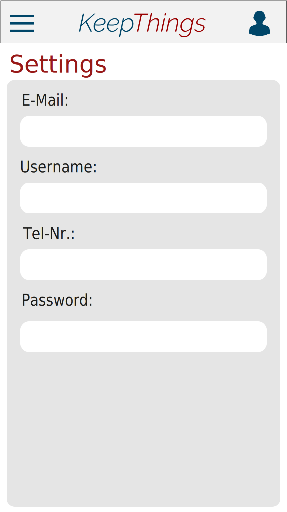
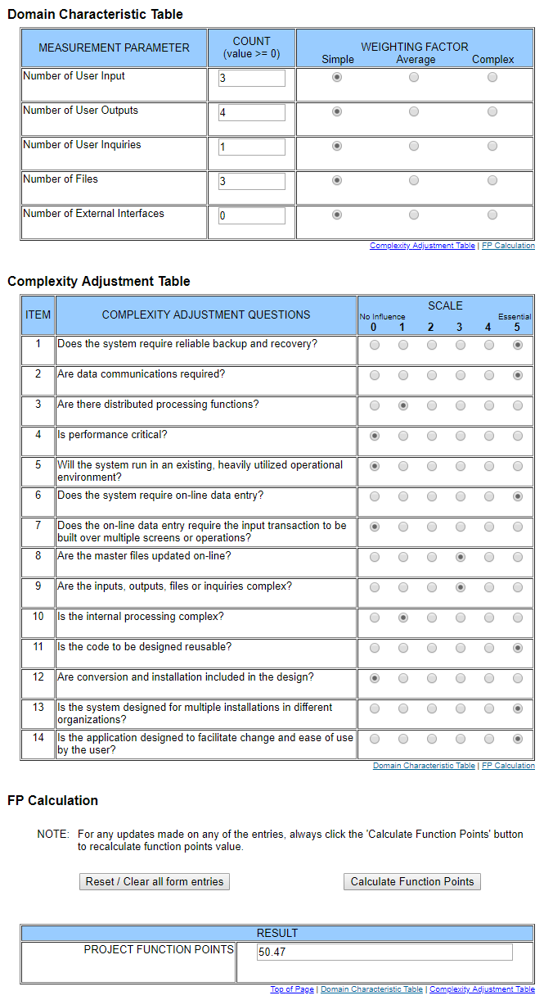

# Use-Case Specification: mobileUserSettings

## 1. mobileUserSettings

### 1.1 Brief Description
In this Use-Case we will be implementing the opportunity to change some user information. The user will be able to change the password, email, username and tel_nr. 

## 2. Flow of Events

### 2.1 Basic Flow

#### Activity Diagram

#### Mockup

## 3. Special Requirements

n/a

## 4. Preconditions

## 5. Postconditions

### 5.1 synchronization of data
synchronization of the data between server and client.

## 6. Extension Points
### 6.1 Funktion Point Calculation

