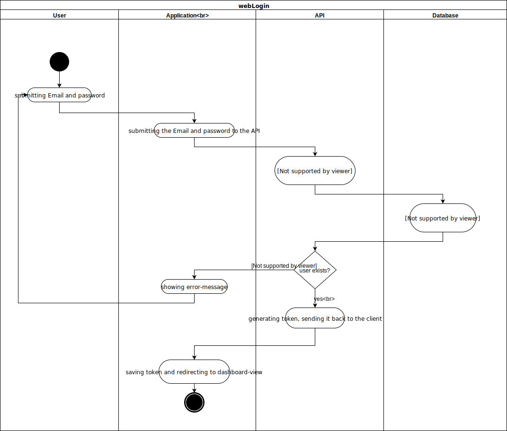
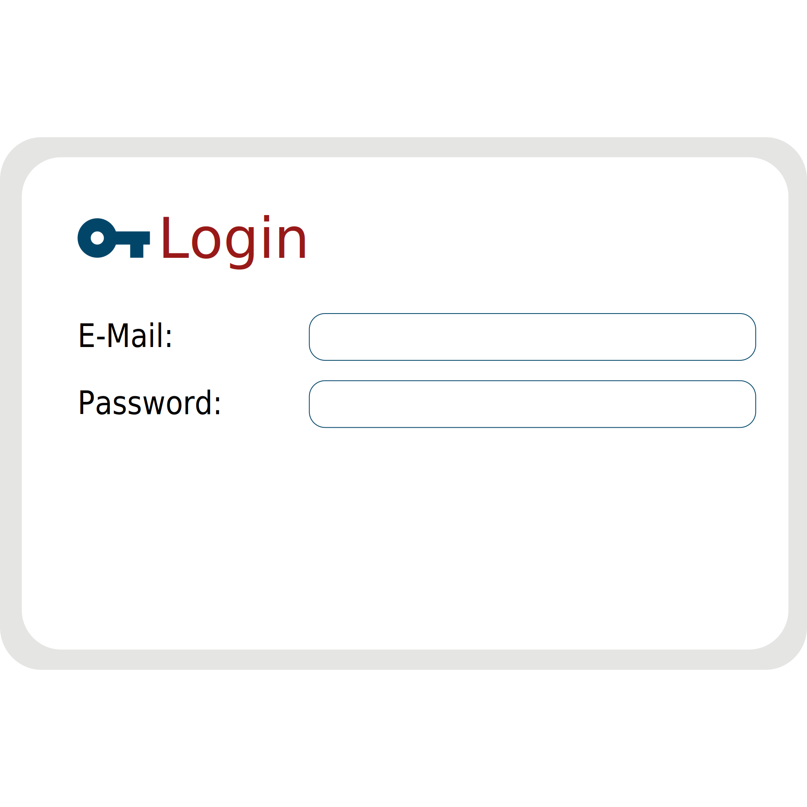

# Use-Case Specification: webLogin

## 1. webLogin

### 1.1 Brief Description

In this Use-Case we will be implementing the login interface for our web application. The user will be able to enter a valid email and password which is then validated by our api. If the user enters valid credentials he/she is redirected to the dashboard.

## 2. Flow of Events

### 2.1 Basic Flow

#### Activity Diagram

#### Feature

#### Mockup

## 3. Special Requirements

n/a

## 4. Preconditions

## 5. Postconditions

### 5.1 redirecting the user to the dashboard view
The user shall be redirected to the dashboard view.

## 6. Extension Points
n/a 

