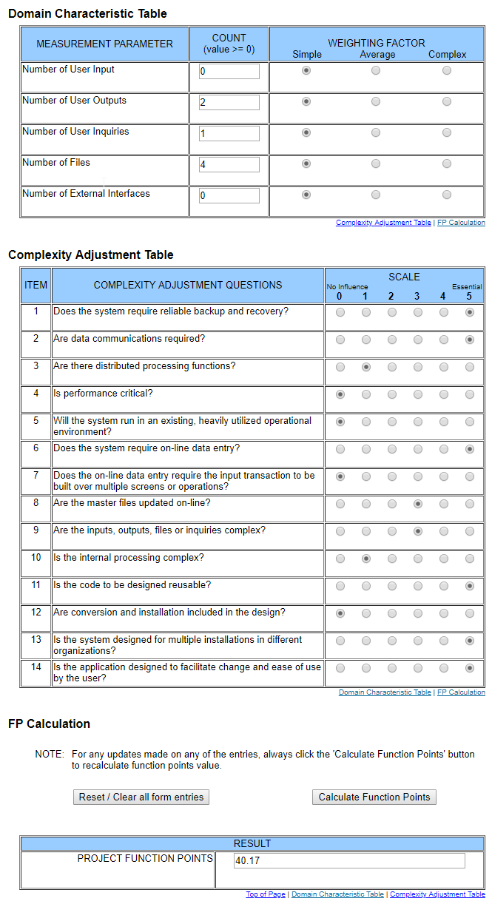

# Use-Case Specification: webMaketplace

## 1. webMaketplace

### 1.1 Brief Description

## 2. Flow of Events

### 2.1 Basic Flow

#### Activity Diagram

#### Feature
tbd
#### Mockup
tbd

## 3. Special Requirements

n/a

## 4. Preconditions

### 4.1 Log in
The user must be logged in first.

## 5. Postconditions

### 5.1 synchronization of data
synchronization of the data between server and client.

## 6. Extension Points
### 6.1 Funktion Point Calculation

