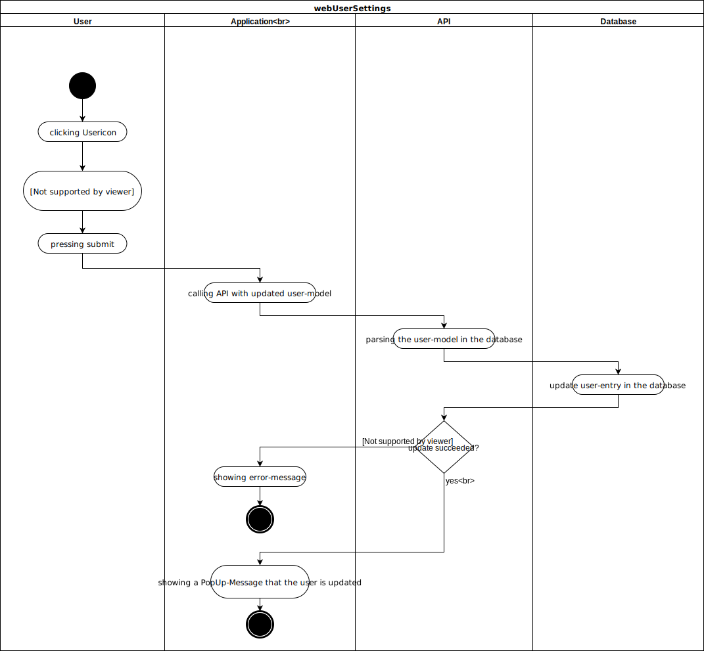
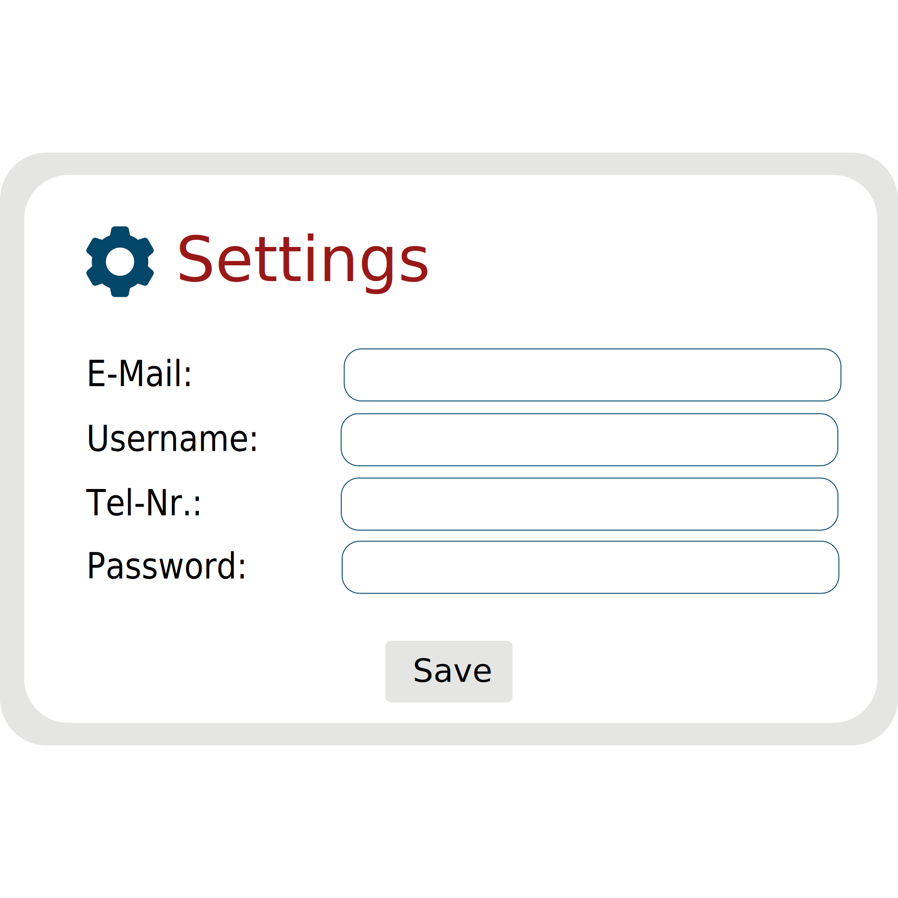

# Use-Case Specification: webUserSettings

## 1. webUserSettings

### 1.1 Brief Description

In this Use-Case we will be implementing the opportunity to change some user information. The user will be able to change the password, email, username and tel_nr. 

## 2. Flow of Events

### 2.1 Basic Flow

#### Activity Diagram

#### Feature

#### Mockup

## 3. Special Requirements

n/a

## 4. Preconditions

### 4.1 Log in
The user must be logged in first.

## 5. Postconditions

### 5.1 synchronization of data
synchronization of the data between server and client.

## 6. Extension Points
n/a 

