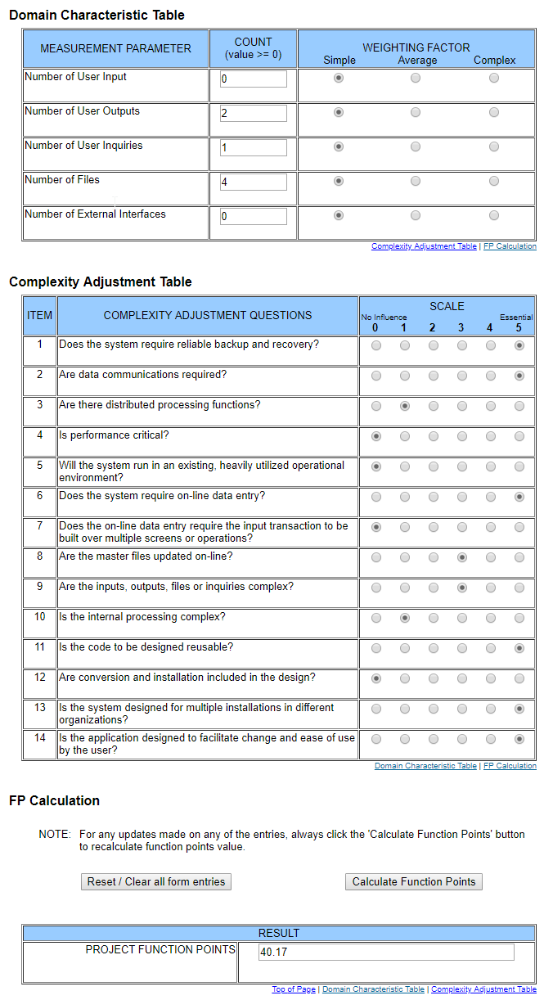

# Use-Case Specification: mobileMarketplace

## 1. mobileMarketplace

### 1.1 Brief Description
Shows all marketplace items of the community in a list. One item contains the name of the lent item, person who need the item, the date it is needed and the date it should be returned. 

## 2. Flow of Events

### 2.1 Basic Flow

#### Activity Diagram

#### Feature
tbd
#### Mockup
tbd

## 3. Special Requirements

n/a

## 4. Preconditions

### 4.1 Log in
 The user must be logged in first.

 
## 5. Postconditions

### 5.1 synchronization of data
synchronization of the data between server and client.

## 6. Extension Points
### 6.1 Funktion Point Calculation

