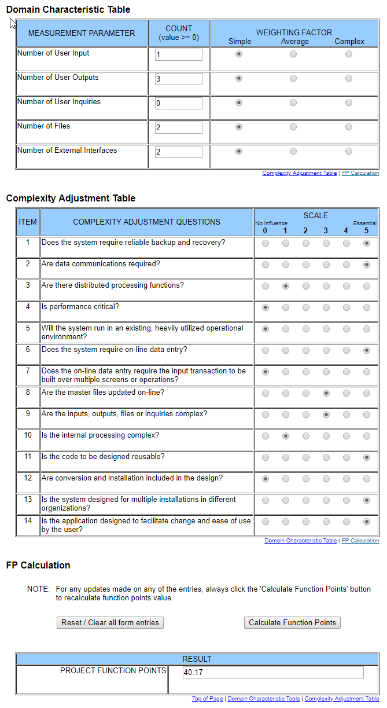

# Use-Case Specification: webLogin

## 1. webLogin

### 1.1 Brief Description

In this Use-Case we will be implementing the login interface for our web application. We will use Auth0 for the identification and validation of the user. The user will be able to enter a email and password which is then validated by Auth0. If the user dosen't have a account right now he will be able to register a new account. After the Login the user is redirected to the dashboard.

## 2. Flow of Events

### 2.1 Basic Flow

#### Activity Diagram

#### Mockup

## 3. Special Requirements

n/a

## 4. Preconditions

## 5. Postconditions

### 5.1 redirecting the user to the dashboard view
The user shall be redirected to the dashboard view.

## 6. Extension Points
### 6.1 Funktion Point Calculation

