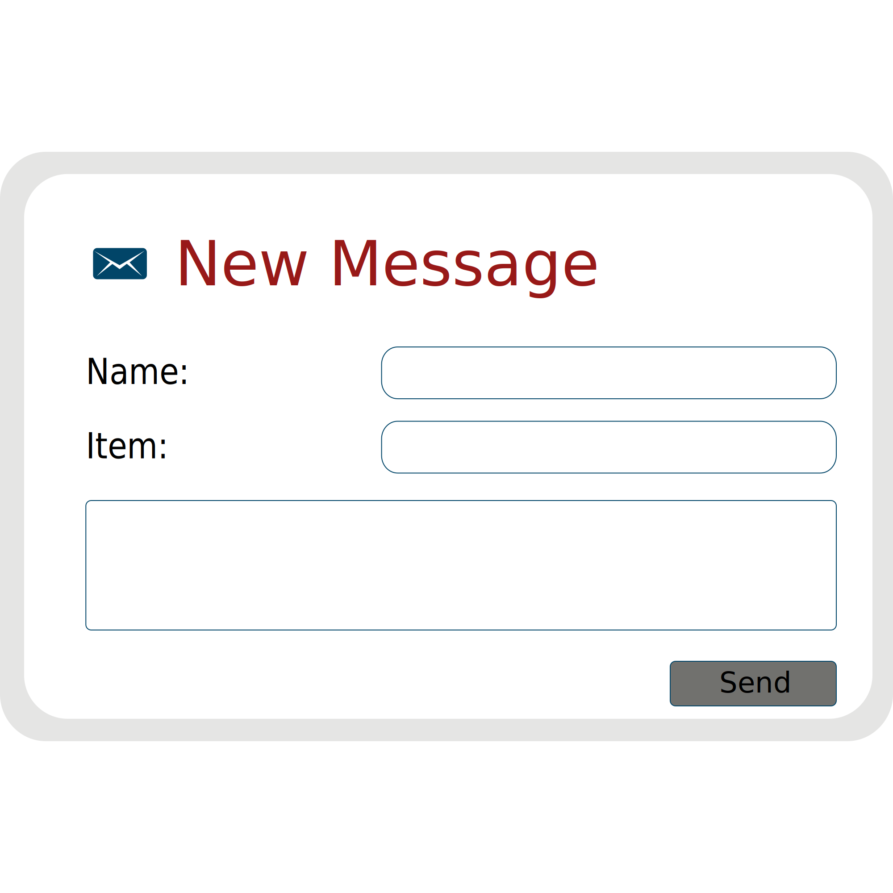

# Use-Case Specification: Messages

## 1. Messages

### 1.1 Brief Description
By clicking the messageicon in the top right, the user i able to write messages to other users. In the messagewindow he can select between the diffrent chats and all messages he wrote and recieved in the selected Chat.

## 2. Flow of Events

### 2.1 Basic Flow

#### Activity Diagram

#### Feature
tbd
#### Mockup

## 3. Special Requirements

n/a

## 4. Preconditions

### 4.1 Log in
The user must be logged in first.

## 5. Postconditions

### 5.1 synchronization of data
synchronization of the data between server and client.

## 6. Extension Points
n/a 

