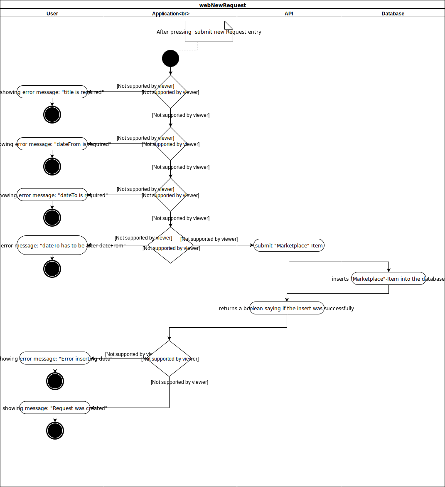
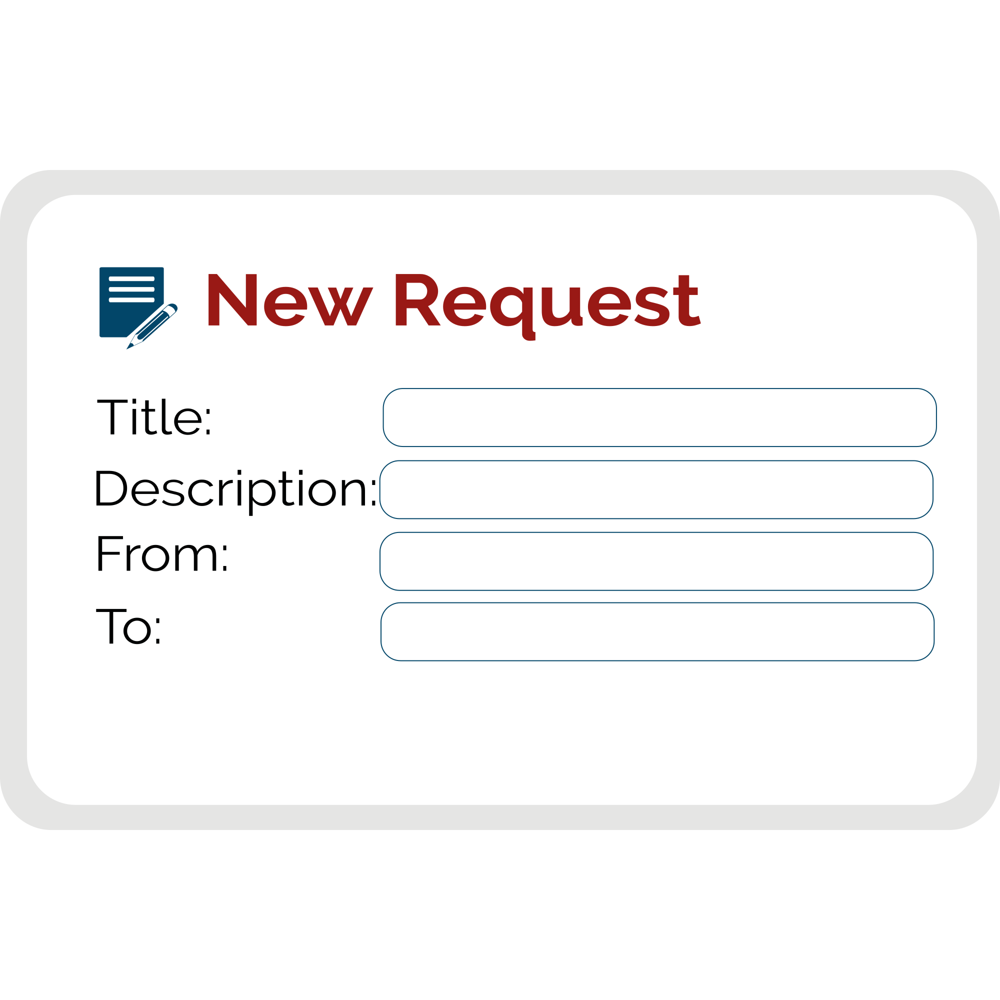

# Use-Case Specification: webNewRequest

## 1. webNewRequest

### 1.1 Brief Description
The user can create a new request via the new request form. Application checks if all required fields have an input and if the dateTo is later than dateFrom. The created item will be shown in the marketplacitem list.

## 2. Flow of Events

### 2.1 Basic Flow

#### Activity Diagram

#### Feature
tbd
#### Mockup

## 3. Special Requirements

n/a

## 4. Preconditions

### 4.1 Log in
The user must be logged in first.

## 5. Postconditions

### 5.1 synchronization of data
synchronization of the data between server and client.

## 6. Extension Points
n/a 

