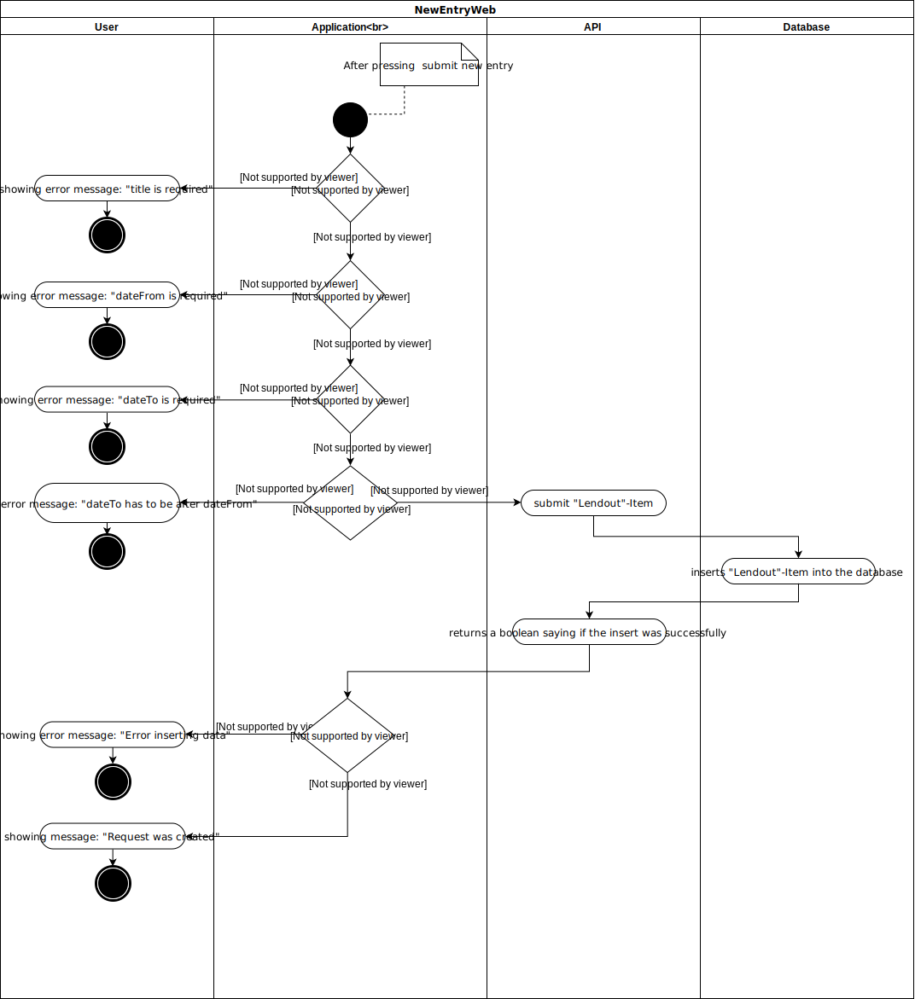
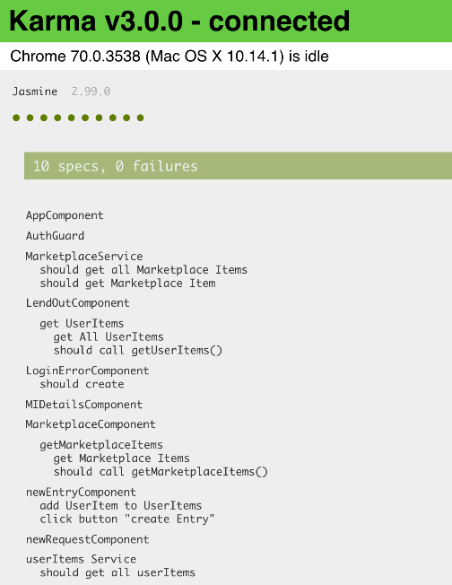
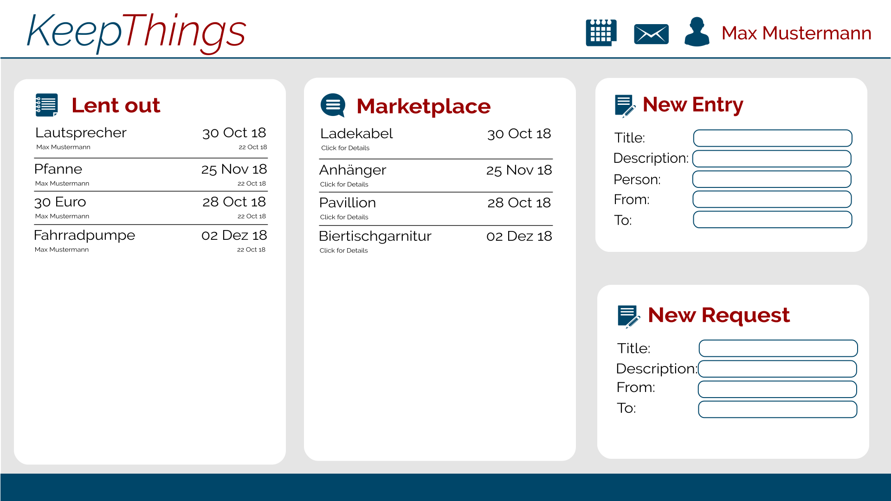
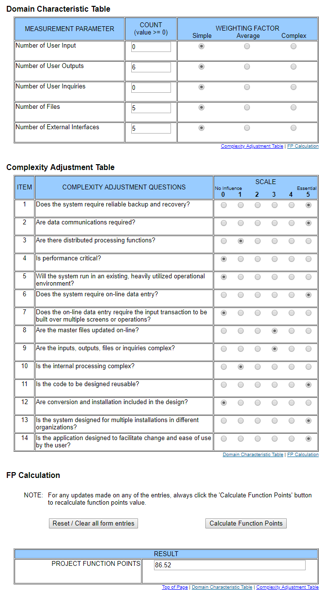

# Use-Case Specification: webNewUserItem

## 1.                  webNewUserItem

### 1.1               Brief Description
User can add a new Entry via the entry form. Application checks if all required fields have an input and if the dateTo is later than dateFrom.

## 2.                  Flow of Events

### 2.1               Basic Flow

#### Activity Diagram

#### Feature

#### Mockup

	
## 3.                  Special Requirements
n/a

## 4.                  Preconditions

### 4.1               Log in
 The user must be logged in first.
 
 
## 5.                  Postconditions

### 5.1               add Item to Lend-Out-Items
adds the new Item to the Lend-Out Item List

## 6.                  Extension Points
### 6.1 Funktion Point Calculation

