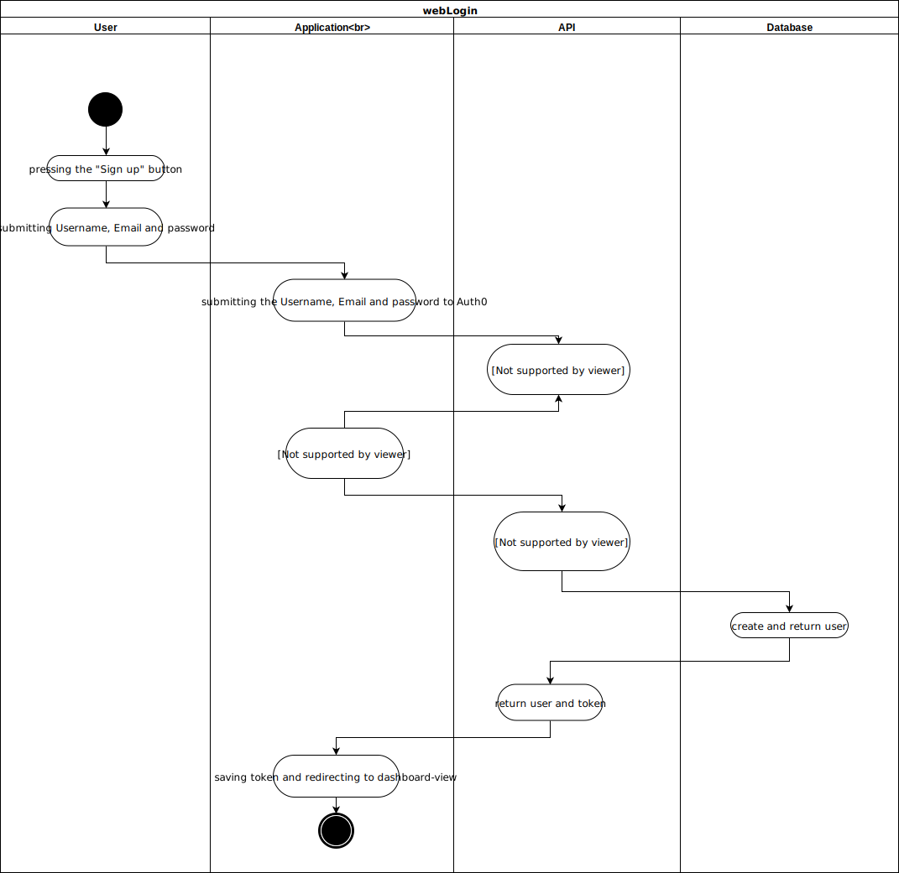
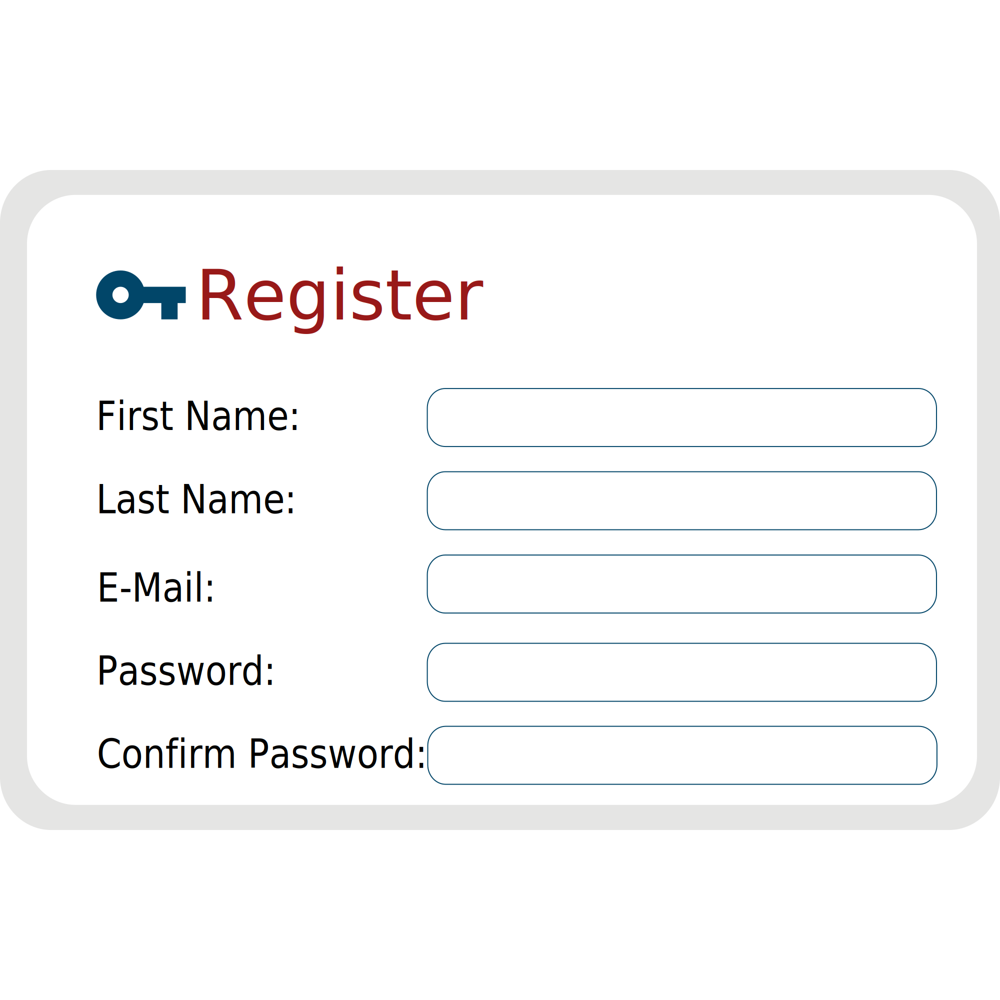

# Use-Case Specification: UC NAME

## 1. UC NAME

### 1.1 Brief Description
The User will be able to register if he dosen't already have a account. The registration is handelt with Auth0. After the User registered in Auth0 and he logins the first time, he will be able to give his first- and secondname in a popup window. With this step the registration is complete and the user is loged in.

## 2. Flow of Events

### 2.1 Basic Flow

#### Activity Diagram

#### Feature
tbd
#### Mockup

## 3. Special Requirements
n/a
## 4. Preconditions
n/a
## 5. Postconditions

### 5.1 synchronization of data
synchronization of the data between server and client.

## 6. Extension Points
n/a 

